# 🏃‍♂️ SmartRunSense: IoT-Based Environmental Monitoring and Prediction System 

  
  
  
  
  
  

## 📖 Overview
Outdoor running provides cardiovascular and mental health benefits, but exposes runners to thermodynamic and respiratory stresses caused by environmental conditions like heat, humidity, particulate matter, and gaseous pollutants. SmartRunSense is an Internet of Things (IoT) system designed to optimize performance and reduce physiological risks by helping runners make informed decisions about when and where to train. 

The system combines real-time environmental sensing, cloud-based data storage, machine learning predictive analytics, and a companion mobile application to provide both current and forecasted environmental conditions. 

---

## 🗺️ System Architecture Diagram
The diagram below illustrates the comprehensive project structure and data connections, organizing the system into four distinct logical layers: Edge Hardware (Wearable and Smart Pole nodes with their shared sensor suite), Cloud Ingestion & Storage (Firestore acting as the central data hub), Cloud Processing (Google Cloud Run executing the scikit-learn Random Forest forecasting engine), and the Application Layer (Mobile App visualizing live and forecasted conditions).

  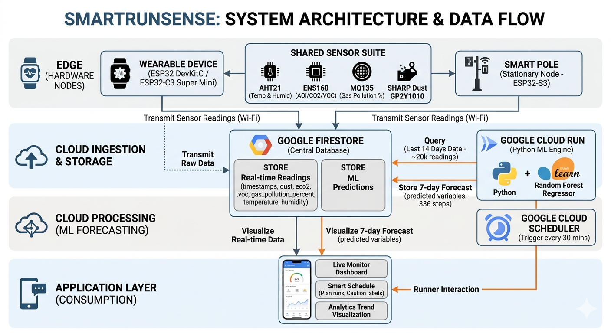

---

## ✨ Key Features
* 📡 **Real-Time Monitoring:** Collects localized environmental data using wearable devices and stationary "Smart Poles".
* 🤖 **Machine Learning Forecasting:** Automatically predicts air quality and weather conditions 7 days into the future.
* 📱 **Mobile Application:** Provides a live sensor dashboards, historical analytics, and a "Smart Schedule" to plan the safest times to jog.

---

## 🛠️ Hardware Architecture

The system utilizes a dual-node hardware approach, consisting of mobile wearable devices and stationary monitoring nodes ("Smart Poles"). 

## ⌚ 1. Wearable Device
Designed for mobility, this node can be built using either an **ESP32 DevKitC** or a compact **ESP32-C3 Super Mini** microcontroller. 

  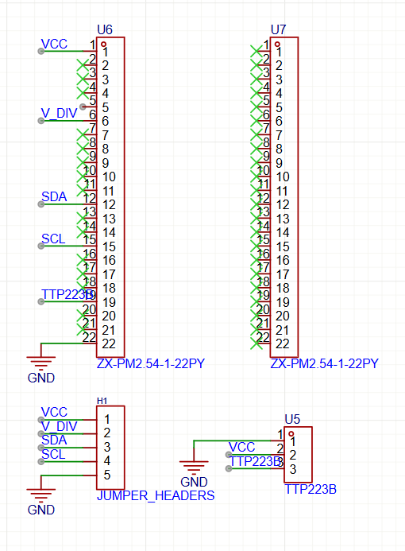
  &nbsp;
  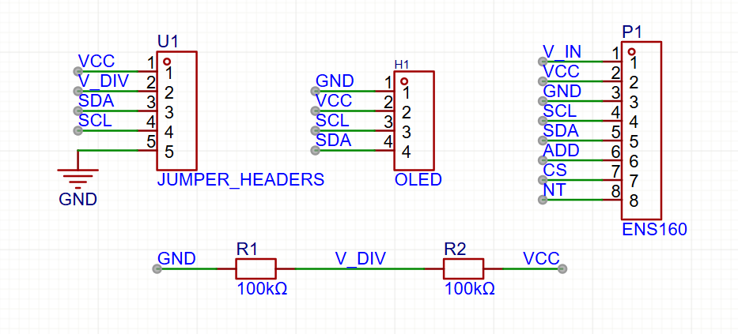
  &nbsp;
  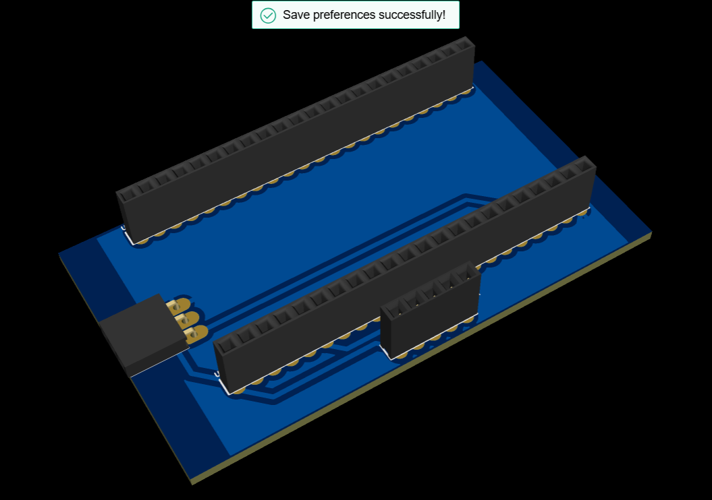
  &nbsp;
  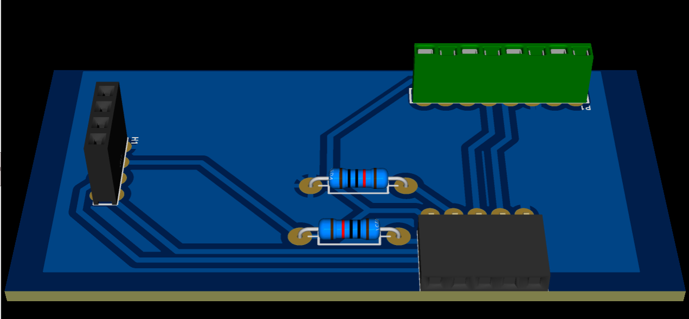
  &nbsp;
  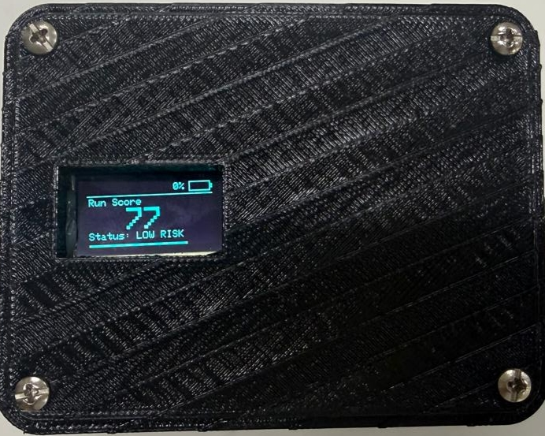
  &nbsp;
  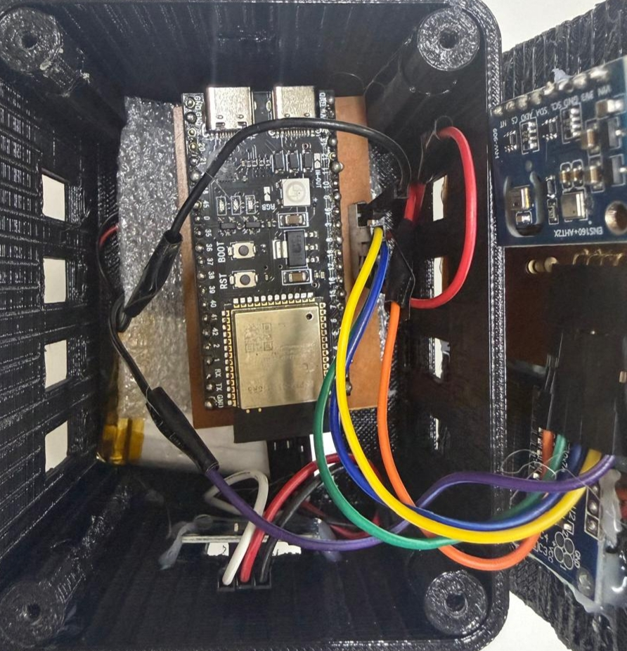 

---

## 🗼 2. Smart Pole (Stationary Node)
Designed for continuous environmental monitoring at fixed locations (like running tracks or parks), this node is powered by a more robust **ESP32-S3** module.

  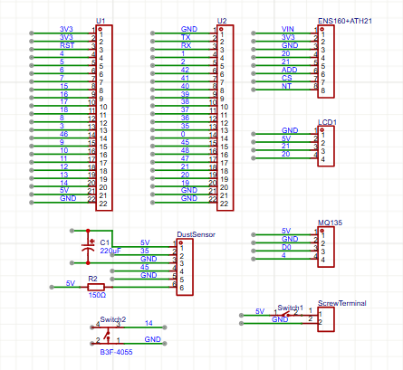
  &nbsp;
  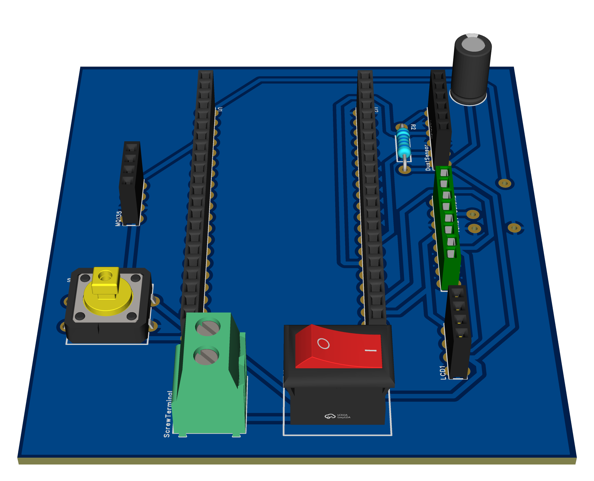
  &nbsp;
  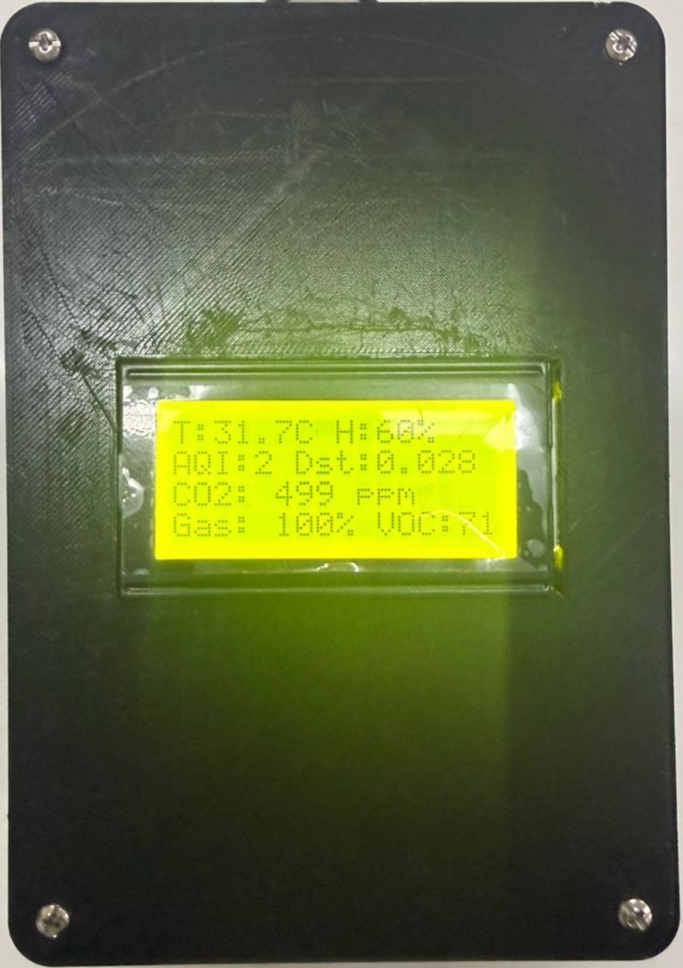
  &nbsp;
  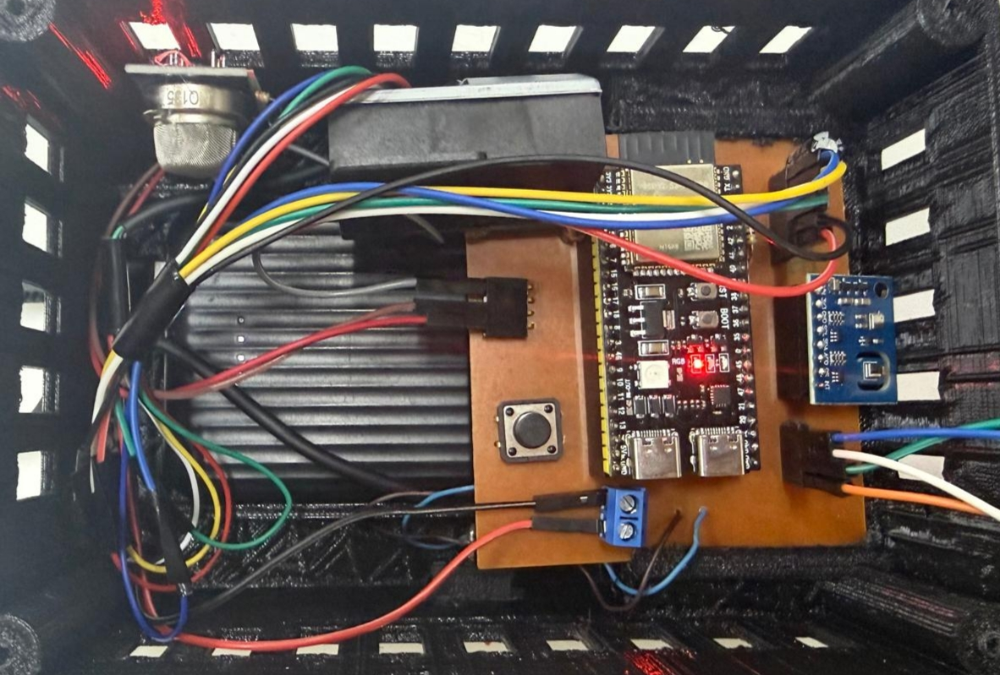

---

Both the wearable and the Smart Pole devices interface with the following shared sensor suite and components:

## 🌡️ Sensors
* 🌬️ **ENS160 (Air Quality):** A self-calibrated digital sensor that measures the Air Quality Index (AQI), eCO2 (400-65,000 ppm), and Total Volatile Organic Compounds (TVOC).
* 💧 **AHT21 (Temperature & Humidity):** Factory-calibrated sensor measuring temperature (-40°C to +85°C) and relative humidity.
* 🏭 **MQ135 Gas Sensor:** An analog chemoresistive sensor used to measure general gas pollution intensity (0-100% scale), including Ammonia, NOx, Alcohol, Benzene, and Smoke. It uses a voltage divider circuit to safely interface the 5V sensor with the 3.3V ESP32.
* 💨 **SHARP GP2Y1010 Dust Sensor:** An optical sensor with an internal infrared LED and photodiode used to detect fine particles like dust, pollen, and smoke.

---

## 🧠 Machine Learning Forecasting Engine & ☁️ Cloud Infrastructure
A Python-based Cloud Run microservice acts as the forecasting engine.

* ⚙️ **Execution:** Triggered every 30 minutes by Google Cloud Scheduler.

  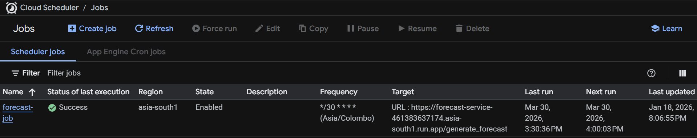

* 📈 **Algorithm:** Uses a Random Forest Regressor (via scikit-learn) because it efficiently handles the highly non-linear nature of environmental data and trains in seconds using standard CPUs without requiring strict data scaling.

  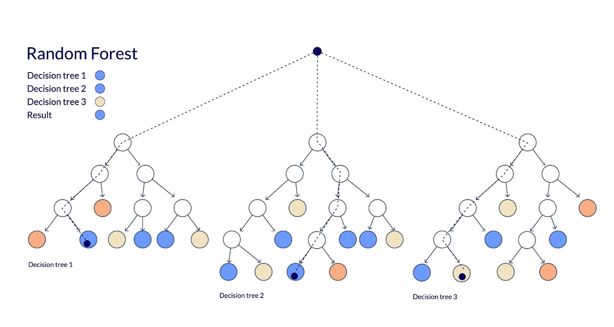

* 📊 **Data Scope:** The model queries the last 14 days (~20,000 readings) of data from Firestore to learn daily and weekly patterns.

* 🔮 **Output:** Generates predictions in 30-minute intervals for exactly 7 days into the future (336 distinct prediction steps per run). It predicts 7 variables simultaneously: Temperature, Humidity, Dust Density, AQI, TVOC, CO2, and Gas Pollution Percentage.

---

## 🗄️ Database
* 🔥 **Google Firestore:** Acts as the primary database, storing real-time sensor readings (e.g., timestamps, dust, eco2, tvoc, gas_pollution_percent, temperature, humidity) and the ML-generated predictions.
  

  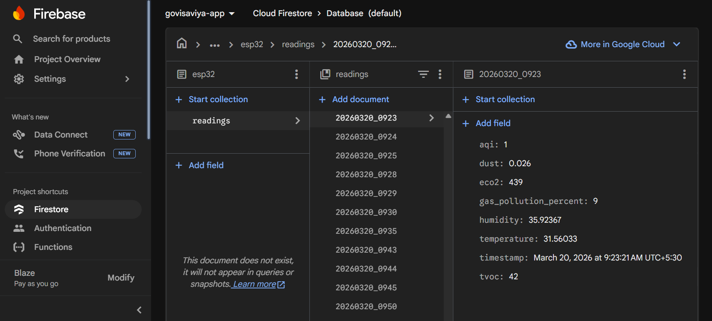

---

## 📱 Mobile Application
The mobile UI provides comprehensive data visualization for the end-user:

* 📊 **Live Monitor:** Displays real-time metrics including a summarized "Run Score" (e.g., 77% - LOW RISK) and individual sensor percentages.
* 📅 **Plan Your Activity (Smart Schedule):** Allows users to view upcoming days and flags specific time slots (e.g., "21:00 Caution Required - Pollution or heat levels elevated") to help them plan the best time to run.
* 📉 **Analytics:** Visualizes historical trends and insights, such as Dust and CO2 levels over time.
* 🌤️ **Forecast:** Displays the upcoming environmental predictions generated by the cloud microservice.

## 📸 App Screenshots

  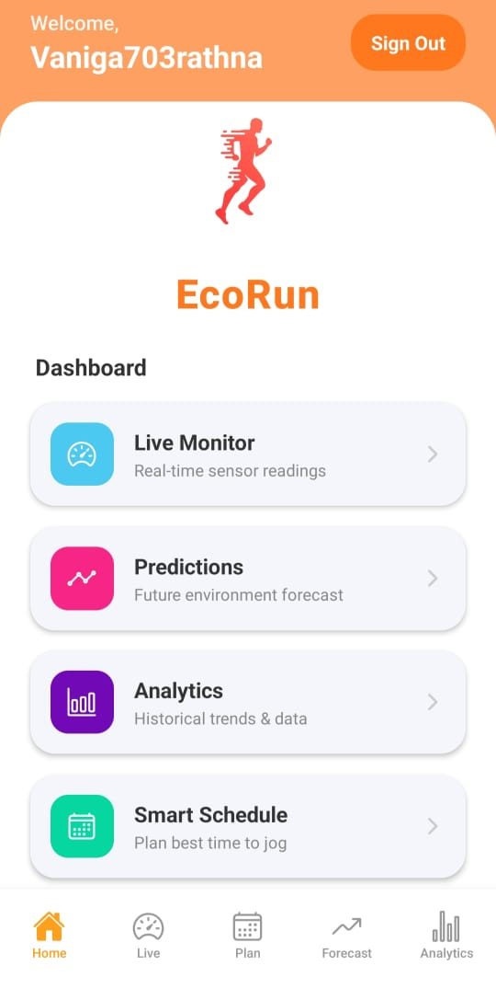
  &nbsp;
  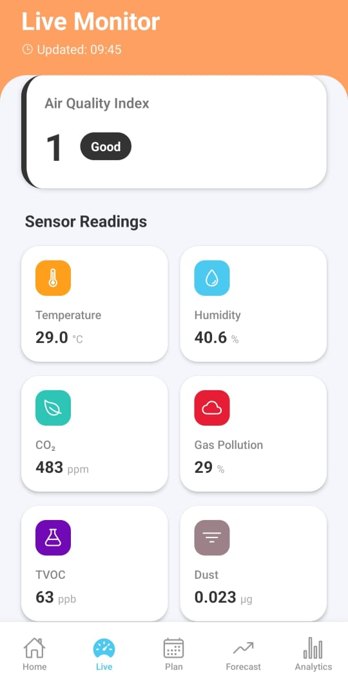
  &nbsp;
  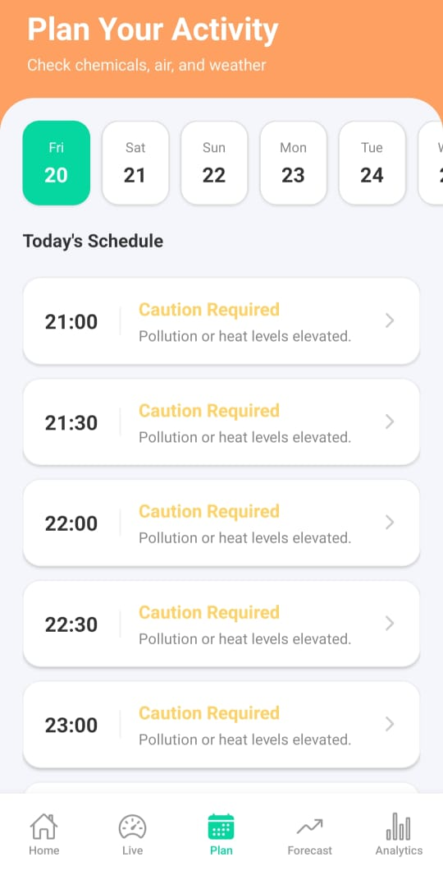
  &nbsp;
  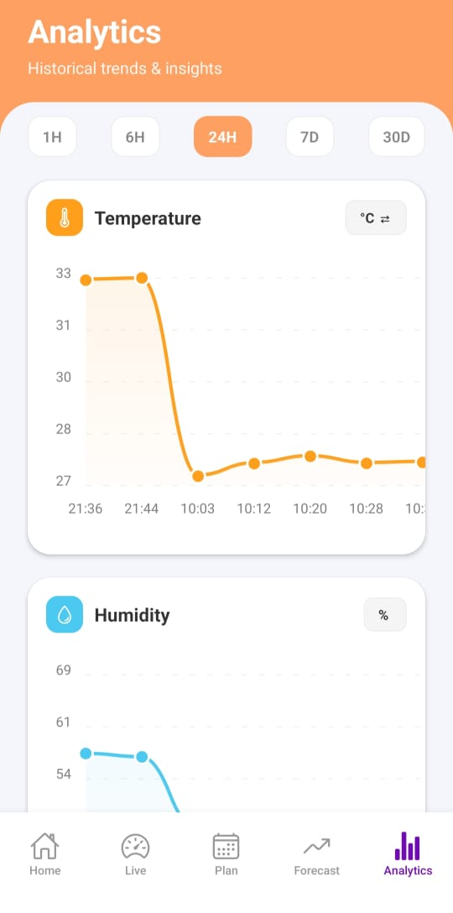
  &nbsp;
  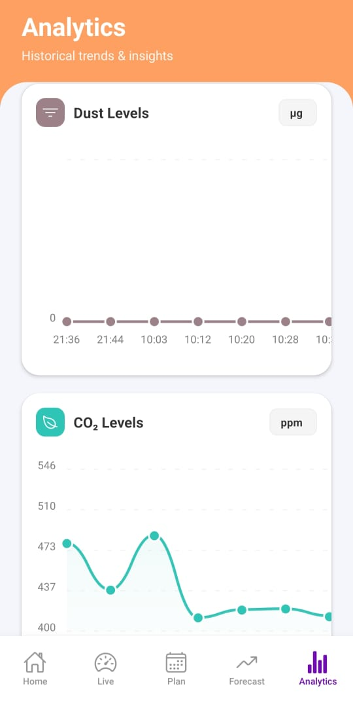

